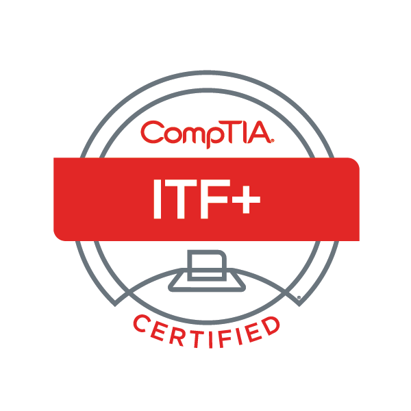
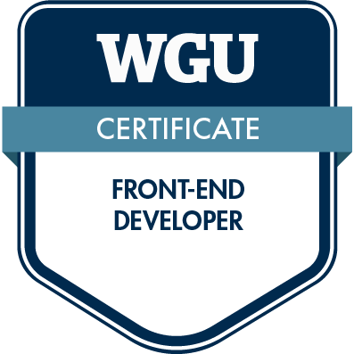

<!-- 2022-2024 OzzyTheDev, Please Don't Copy -->

# Hello All, I'm Jason!

I am a University Student studying for my B.S Degree in Software Engineering

Certificate Goals:

- AWS Certified Solutions Architect - Associate (Mar 2025)
- Scrum Master Certification (CSM) (Mar 2025)
- Docker Certified Associate (2025)

Topic Goals:
- Terraform and Kubernetes (2025)
- CI/CD (2025)
- AI (2025)
- Mobile App Development

Goals:
- Release MyArtverse to the public (2025)
- Finish Sparrow Project (Solo) as a Hobby Project (2025)
- Get that Software Engineering Degree

## My Certificates

  

  

