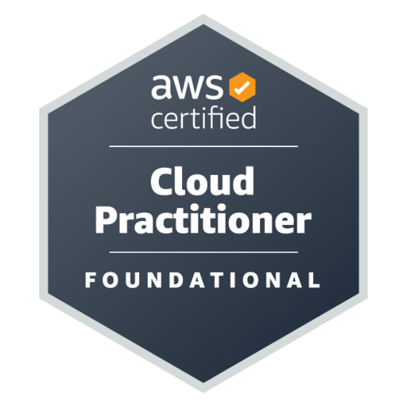
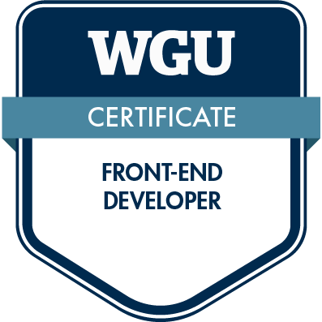
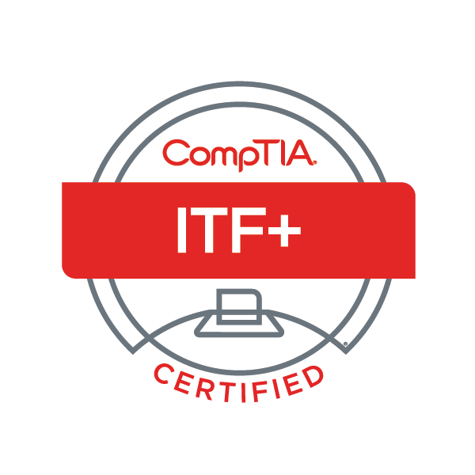

<!-- 2022-2024 OzzyTheDev, Please Don't Copy -->

# Hello All, I'm Jason!

Full Stack React Software Dev that likes Java and C#

## My Education

- B.S. Degree in Software Engineering (May 2025)
- Studying at WGU for B.S. in Cybersecurity (Graduating July 2026)

## Certificate Goals

- ~~CompTIA A+ (2025)~~ (Completed)
~~- CompTIA Network+ (2025)~~ (Completed)
~~- CompTIA Security+ (2025)~~ (Completed)
- CompTIA Pentest+ (2025)
- CompTIA CySA+ (2025)

## Topic Goals
- Terraform and Kubernetes (2027)
- CI/CD (2026)
- AI (2026)(?)
- Game Dev (2026)
- Blender (2026)
- ~~Mobile App Development~~

## Goals
- ~~Get that Software Engineering Degree~~
- Complete Cybersecurity Degree
- Go for a master's degree(?)

## My Certificates

  

  

